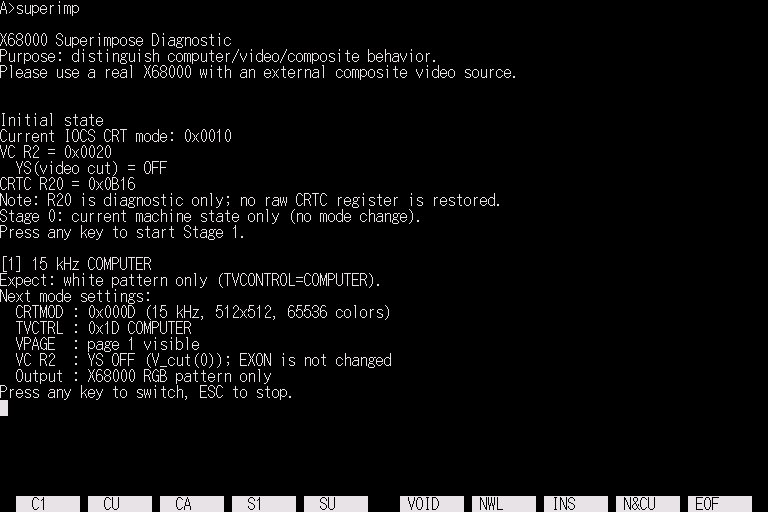

# superimp

[English](README.md) | [日本語](README.ja.md)

  

  <strong><a href="https://uraraworks.github.io/WebX68k/?cpu=10&ram=12&fd1=https://raw.githubusercontent.com/renatus-novus-x/superimp/main/dist/superimp.zip&run=1">WebX68kでsuperimpを起動</a></strong>

Sharp X68000でコンピュータ画面、外部ビデオ画面、スーパーインポーズ画面を
確認するための、Human68k用対話型診断・テストパターンプログラムです。

Human68k 3.02の`BASIC2/IMAGE.FNC`と互換性のある、次の制御対応を使用します。

| IMAGE.FNCの操作 | 対応する制御 |
| --- | --- |
| `crt(0)` | IOCS `_TVCTRL(0x1C)`：VIDEO選択 |
| `crt(1)` | IOCS `_TVCTRL(0x1D)`：COMPUTER選択 |
| `crt(2)` | IOCS `_TVCTRL(0x1E)`：コントラストダウンのスーパーインポーズ |
| `crt(3)` | IOCS `_TVCTRL(0x1F)`：標準コントラストのスーパーインポーズ |
| `V_cut(0/1)` | VICON R2 `$E82600`上位バイトのbit 7（16bit R2のbit 15、YS）をクリア／セット |

`crt()`、`V_cut()`、`Vpage()`はそれぞれ独立した制御です。`crt()`は外部の
テレビ／モニターへ制御コマンドを送り、`V_cut()`はVICONのYSによって外部映像を
カットし、`Vpage()`はグラフィックページの表示を制御します。特に`crt(0)`は
TVCTRLのVIDEO選択であり、`V_cut(0)`と`Vpage(0)`によるビデオのみの表示とは
別の操作です。

## 必要な環境

実機ですべてのテストを行うには、次の環境が必要です。

- Human68kが動作するSharp X68000
- 外部コンポジット映像を入力できるX68000純正ディスプレイまたはCZ-6TU
- 外部コンポジット映像ソース

WebX68k用ディスクは、プログラムを簡単に起動して画面や操作を確認するために
用意しています。外部コンポジット入力と物理的なスーパーインポーズ機器は
エミュレートされないため、実際の合成結果は実機で確認してください。

## 使用方法

次のコマンドで起動します。

    superimp.x

最初に元の表示状態を保存し、すべての説明を読みやすく表示するためIOCS CRT
モード13（15kHz、512×512）へ切り替えます。任意のキーで次へ進み、ESC キーで
テストを終了します。元のCRTモードは終了時に復元します。

| ステージ | モード | 期待される表示 |
| --- | --- | --- |
| 1 | TVCTRL COMPUTER、`crt(1)` | X68000グラフィックを表示 |
| 2 | コントラストダウン合成、`crt(2)` | 外部映像とコンピュータグラフィックをコントラストダウンで合成 |
| 3 | 標準スーパーインポーズ、`crt(3)` | 外部映像とコンピュータグラフィックを標準コントラストで合成 |
| 4 | VICON VIDEO CUT、`V_cut(1)` | 外部映像が消え、コンピュータグラフィックが残る |
| 5 | GRAPHICS PAGE OFF、`V_cut(0)`と`Vpage(0)` | グラフィックページが消え、外部映像が残る |
| 6 | スーパーインポーズへ復帰 | 外部映像とコンピュータグラフィックが戻る |
| 7 | TVCTRL COMPUTER、`crt(1)` | 終了前の安全なコンピュータ状態 |

各切り替え前に、使用するCRTMOD、TVCTRL、グラフィックページ、ビデオカット
設定を表示します。ビデオおよびスーパーインポーズのステージは最大8秒で
コンピュータ画面へ戻ります。待機中に任意のキーを押すとすぐに戻り、
ESC キーでは戻った後にテストを終了します。

説明画面と各テストStageでは、IOCS CRTモード13、15kHz、512×512ドット、
65536色を常に維持し、通常はグラフィックページ1を表示します。必要な正規の
モード制御のみを変更します。

終了時には保存したIOCS CRTモードを復元します。`V_cut()`が変更する
`$E82600`の上位バイトだけを保存・復元し、VICON R2の16bit全体は書き戻しません。
TVCTRLには現在状態を取得する機能がないため、安全側の代替としてTV制御を
COMPUTER（`0x1D`）へ戻します。

## ビルド

elf2x68kを導入し、m68k-xelf-gccにPATHが通ったWSLまたはLinux環境で
ビルドします。

必要なホストツールをインストールします。

    sudo apt install python3 curl unar

リポジトリ直下からsrcへ移動して実行します。

    cd src
    make

MakefileはHuman68k 3.02とバージョンを固定したxdftool.pyをダウンロードし、
次のファイルを生成します。

    src/superimp.x     Human68k実行ファイル
    src/superimp.xdf   起動可能なHuman68kディスクイメージ
    dist/superimp.zip  Human68k許諾条件を含むWebX68k対応配布アーカイブ

生成したディスクイメージの内容を確認する場合は次を実行します。

    make check-xdf

生成ファイルはmake cleanで削除できます。ダウンロードした補助ファイルも
削除する場合はmake distcleanを使用します。
